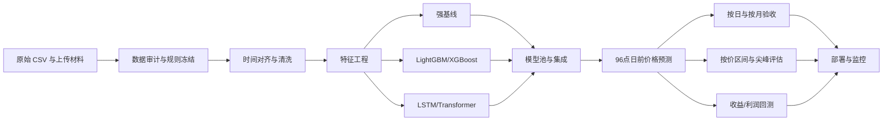
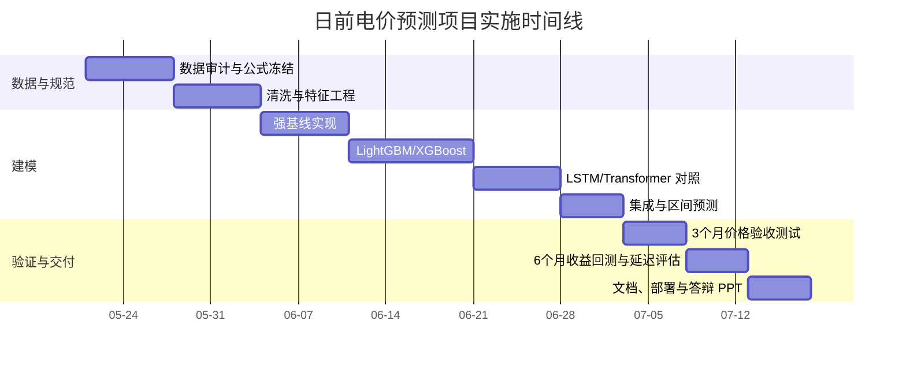

# 基于现有数据与验收条款的日前电价预测与评估实施方案

## 执行摘要

这套方案应当同时满足三层约束。第一层来自你上传的合同截图与老师要求：交付物必须是 **Python 代码 + 技术文档 + 部署说明**，代码需符合 **PEP 8**、具备可读性与可维护性；价格预测侧要覆盖 **未来 24 小时、15 分钟粒度、96 点**，并且落在 **“日平均精度 ≥ 85%”** 这一验收口径上；形式上还要能支撑后续 **至少 3 个月的价格测试** 与 **至少 6 个月的收益/利润回测**。第二层来自上传 PPT 的导则思路：这不是一个“纯 AI 回归题”，而是一个 **连接市场报价、市场出清、电网调度与运行风险** 的工程系统，因而必须做 **强基线比较、多源输入、多模型池、多维评价、风险分析与持续更新**。第三层来自公开文献的 best practice：电价预测研究最常见的问题正是 **测试窗过短、缺少强基线、评价指标不合理、时间序列切分有泄漏、只看统计误差不看应用影响**；因此，复现实验设计必须把这些坑系统性避开。citeturn17view0turn13view0turn5view1turn18view1

基于这些约束，我给出的主线建议很明确：**先用树模型做主交付，再用深度模型做对照，最终以集成为正式版本**。具体说，优先落地一条“**强基线 → LightGBM/XGBoost 主模型 → LSTM/Transformer 对照 → 集成与区间预测**”的路线。公开研究反复表明，新的 EPF 方法如果不与简单且强的基线做长期、滚动、无泄漏比较，很难说明真的有效；同时，多变量模型并不在所有市场、所有时段都稳定优于单变量模型，反而“不同结构的组合”常常更稳。近期综述还指出，深度学习 EPF 正在从单点预测转向 **probabilistic、market-aware** 的设计，因此最终交付最好同时包含 **点预测、区间预测、日级验收统计、分价区间统计、尖峰识别、利润回测与风险报告**。citeturn17view1turn18view0turn18view3turn18view4

在验收口径上，建议把“日平均精度 ≥ 85%”正式固定成 **“日平均相对偏差 ≤ 15%”** 的等价表达，但必须先解决 **Price=0** 时普通 MAPE 失效的问题。Hyndman 与 Athanasopoulos 的教材明确指出，百分比误差在真实值为 0 时会变成未定义，在接近 0 时也会极不稳定；教材还明确不推荐把 **sMAPE** 作为主指标。因此，本项目不能直接把“普通 MAPE”写进验收公式，而应在立项文档里先冻结一个 **修正相对误差口径**。我建议主验收采用 **带下界分母的日均相对误差**，备选口径采用 **按日 WAPE**，同时把 **MAE、RMSE、MASE、按价区间表现、尖峰识别** 列为副指标。citeturn16view1turn16view2turn13view0

## 约束条件与关键假设

### 上传材料转化为工程约束

下面这张表把你上传材料中的要求直接翻译成工程动作，后面的方案全部围绕它展开。

| 约束来源 | 原始要求或导向 | 工程化落地 |
|---|---|---|
| 合同截图 | Python 代码交付、符合 PEP 8、充分注释、提供全部技术文档、配合部署调试 | 使用 `src/` 包化代码、`ruff + black + pytest`、公共函数全部写 docstring、输出安装/部署/推理说明 |
| 合同截图 | 电价预测模型需具备长短周期价格预测功能 | 先交付短周期（96 点日前）主模型；同时预留中长期接口与配置文件 |
| 合同截图 | 测试时间不少于 3 个月；每天 96 点；每月不少于 25 天满足日均相对偏差要求 | 正式价格测试采用 3 个自然月；按日打分、按月统计通过天数 |
| 合同截图 | 收益/利润测试不少于 6 个月；达标月份不少于总测试月份的 50% | 另做 6 个月策略/利润回测，比较“边际成本原始报价”与“预测辅助报价” |
| PPT 导则 | 方法中立，不限制 AI/机器学习/其他方法 | 强基线、树模型、深度模型、集成模型并列比较 |
| PPT 导则 | 关注低价、零价、尖峰、高新能源渗透、模型池、更新、安全 | 指标分层、两阶段模型、漂移监测、区间预测、鲁棒性测试、模型卡 |
| 老师要求 | 不把它当成纯 AI/数学题，要讲预测好坏对系统运行的影响 | 把“预测 → 报价 → 出清 → 调度 → 风险”的分析写进正文和答辩 PPT |

### 对上传数据的离线审计结论

对压缩包中的 `GS(1).csv` 做离线检查后，可以先锁定下面这些事实，它们直接决定清洗与建模路线。

| 审计项 | 离线发现 | 处理原则 |
|---|---|---|
| 时间粒度 | 15 分钟等间隔 | 全流程按 96 点/天建模与评分 |
| 起始与结束 | 首日从 00:15 开始，末尾存在不完整记录 | 首日不作为完整监督日；末尾缺标签日不计入正式评分 |
| 目标缺失 | `Price` 在末尾存在整块缺失 | **目标缺失绝不插值进监督训练**；该日仅作推理冒烟测试 |
| 特征缺失 | `发电总出力预测`、`抽蓄` 存在整块缺失段 | 按“短缺口插值、长缺口同槽位回填、同时打缺失标记”的分层规则处理 |
| 疑似异常 | 个别时刻存在数量级明显异常的外生变量 | 用规则阈值 + Hampel/MAD 检测并替换，同时记录审计日志 |
| 价格结构 | 数据中存在大量 0、40、400、1000 附近的离散价格水平 | 不能只做连续回归；应加入价区间/尖峰识别或两阶段建模 |

### 需要冻结的假设

这份方案默认以下假设成立。如果老师后续给出更精确的业务定义，只需要改评估模块，不需要推翻整套设计。

| 假设 | 推荐取值 | 如果不成立怎么办 |
|---|---|---|
| `GS(1).csv` 中外生变量与 `Price` 已按交割时段对齐 | 成立 | 若外生变量在报价截止时尚不可得，则需额外为这些变量先做上游预测模块 |
| “日平均精度 ≥ 85%” 等价于“日平均相对偏差 ≤ 15%” | 成立 | 若老师给出另一公式，只切换 `src/eval/metrics.py` |
| 零价是有效市场状态，不是缺失 | 成立 | 训练与评估中零价保留，禁止被当作缺失值 |
| 3 个月价格验收按自然月统计“≥25 天通过” | 推荐 | 若老师只看整体平均，则在报告中同时输出自然月与全周期两个版本 |

## 数据准备与清洗

公开的预测方法论强调，真正可靠的评估必须用 **genuine out-of-sample forecasts**，测试集至少要与最大预测步长一样大，实践里 often 会拿大约 20% 的后段样本作 hold-out；同时，时间序列交叉验证必须保证样本 **等间隔**、不能用未来数据训练过去，并可以通过 `gap` 排除泄漏。你的数据天然是 15 分钟等间隔，这一点很适合做标准的日级切分与滚动验证。citeturn13view0turn5view1

### 清洗流水线

建议把清洗过程做成 **固定、可复现、可记录** 的流水线，而不是在 notebook 里临时手工改值。具体规则如下。

| 步骤 | 规则 | 输出字段 |
|---|---|---|
| 时间解析 | `Date` 转 `datetime`，排序，按 15 分钟重建连续索引 | `ts`、`slot`、`date` |
| 完整日识别 | 只把 00:00–23:45 共 96 点齐全的日子标为完整日 | `is_full_day` |
| 目标缺失处理 | `Price` 缺失的日子不进入监督训练与正式验收 | `target_available` |
| 特征缺失处理 | 短缺口 `<=8` 个点做时间插值；中缺口 `<=96` 个点优先用同槽位近 7 天中位数；长缺口保留回填值同时打 flag | `*_missing_flag`、`*_imputed_flag` |
| 异常值处理 | 先用物理/业务边界，再用 Hampel/MAD 检测；替换用局部中位数或同槽位季节中位数 | `*_outlier_flag` |
| 零价保留 | `Price==0` 是有效标签，不允许替换为 `NaN` | 无 |
| 审计留痕 | 所有删改写入 `data_audit_log.csv` | `audit_log` |

如果只说一个原则，那就是：**目标缺失不补、特征缺失有限补、所有补值都要保留质量标记**。这既符合工程可追溯性，也方便后续做“缺失是否污染模型”的敏感性分析。

```python
# src/data/clean.py
from __future__ import annotations

from pathlib import Path
import numpy as np
import pandas as pd

EXOG_COLS = [
    "发电总出力预测", "竞价空间", "统一负荷预测",
    "抽蓄", "统一新能源预测", "联络线计划",
]

def hampel_replace(series: pd.Series, window: int = 4, n_sigma: float = 6.0) -> pd.Series:
    """用 Hampel 规则标记并替换局部异常值。"""
    x = series.copy()
    med = x.rolling(2 * window + 1, center=True, min_periods=1).median()
    mad = (x - med).abs().rolling(2 * window + 1, center=True, min_periods=1).median()
    scale = 1.4826 * mad.replace(0, np.nan)
    mask = ((x - med).abs() > n_sigma * scale).fillna(False)
    x.loc[mask] = med.loc[mask]
    return x

def load_and_clean(path: str | Path) -> pd.DataFrame:
    df = pd.read_csv(path)
    df["ts"] = pd.to_datetime(df["Date"], errors="coerce")
    df = df.dropna(subset=["ts"]).sort_values("ts").reset_index(drop=True)

    full_index = pd.date_range(df["ts"].min(), df["ts"].max(), freq="15min")
    df = df.set_index("ts").reindex(full_index).rename_axis("ts").reset_index()
    df["slot"] = ((df["ts"].dt.hour * 60 + df["ts"].dt.minute) // 15).astype("int16")
    df["date"] = df["ts"].dt.date

    df["target_available"] = df["Price"].notna().astype("int8")

    for col in EXOG_COLS:
        df[f"{col}_missing_flag"] = df[col].isna().astype("int8")
        # 先局部异常修复，再补缺
        df[col] = hampel_replace(df[col])
        # 短缺口：时间插值
        df[col] = df[col].interpolate(limit=8, limit_direction="both")
        # 长一些的缺口：同槽位近7日中位数
        slot_med = (
            df.groupby("slot")[col]
            .transform(lambda s: s.shift(1).rolling(7, min_periods=3).median())
        )
        df[col] = df[col].fillna(slot_med)
        df[f"{col}_imputed_flag"] = df[col].isna().astype("int8")

    # 只保留监督可用的完整日，正式训练/验证时再进一步切分
    day_cnt = df.groupby("date")["Price"].count()
    full_days = day_cnt[day_cnt == 96].index
    df["is_full_day"] = df["date"].isin(full_days).astype("int8")
    return df
```

### 特征工程

在电价预测里，外生变量绝不是“可有可无的装饰”。一项机器学习敏感性研究发现，需求、风光等外部预测量的加入可以把 RMSE 最多降到约 **21.96%** 的改善量级；另一项 2024 年研究则直接把价格与供需量之间的经济先验写成分段线性结构，指出这种“市场机理显式化”能显著提升日前电价预测表现。换句话说，你的数据列里最有价值的不是只有历史 `Price`，而是 **`统一负荷预测`、`统一新能源预测`、`竞价空间`、`联络线计划`、`发电总出力预测`** 这类供需与市场状态量。citeturn21academia2turn18view2

建议把特征分成六组，既适合树模型，也适合后续序列模型。

| 特征组 | 具体内容 | 说明 |
|---|---|---|
| 时间特征 | 槽位 `slot`、小时、星期几、月份、是否周末、正余弦周期编码 | 捕获稳定季节性与日内周期 |
| 历史价格滞后 | `t-96`、`t-192`、`t-672`、`t-1344` 的同槽位价格 | 分别对应前 1/2/7/14 天 |
| 同槽位滚动统计 | 近 3/7/14/28 天同槽位均值、中位数、标准差、零价占比 | 对付强日内周期与价位簇 |
| 外生原始特征 | 六个原始预测字段 | day-ahead 业务上最关键 |
| 交互特征 | `净负荷 = 统一负荷预测 - 统一新能源预测`、`供需裕度 = 发电总出力预测 - 统一负荷预测`、`新能源/负荷比`、`竞价空间/负荷比` | 用经济含义压缩高维度 |
| 质量与机制特征 | 缺失标志、异常修复标志、前一日最高/最低/价差、尖峰次数、零价比例 | 对脏数据和 regime shift 更稳 |

对于神经网络，所有连续变量应只用 **训练集统计量** 做标准化；对于树模型，不必强制缩放，但异常裁剪和缺失标记仍然重要。近期关于 EPF 的自适应标准化研究把 **dataset shift** 视为核心难题，另有 2025 年短训练窗研究指出，LightGBM 在较短滚动窗口中对季节性和峰值事件保持了较强鲁棒性。这意味着你的工程方案不能只靠一次性全量训练，而要预留 **滚动窗、多窗长对比与定期重训**。citeturn1academia3turn21academia1

### 样本构造与样本划分

从工程可控性与可复现性出发，建议同时准备两种数据视图。

第一种是 **行级单槽位视图**：每一行预测一个未来 15 分钟价格点。这最适合 LightGBM/XGBoost 的全球模型。第二种是 **日级序列视图**：输入过去若干天及目标日的外生特征，直接输出下一天 96 点曲线。这最适合 LSTM/Transformer 的 seq2seq 结构。两种视图的评测口径完全统一，最终都回到“按天打分”的验收口径。

正式切分建议按如下日期冻结：

| 用途 | 建议区间 | 说明 |
|---|---|---|
| 训练集 | 2024-01-02 至 2025-10-31 | 避开首个不完整日 |
| 调参验证集 | 2025-11-01 至 2026-01-27 | 约 3 个月，用于早停与权重学习 |
| 正式价格验收集 | 2026-01-28 至 2026-04-27 | 满足“至少 3 个月”要求；排除尾部缺标签日 |
| 收益/利润回测集 | 2025-10-28 至 2026-04-27 | 满足“至少 6 个月”要求 |

在训练阶段，再叠加一个 **滚动时间序列交叉验证**。文档上建议使用 `TimeSeriesSplit(n_splits=6, test_size=28天, gap=1天)` 的思想：每个 fold 测 28 天，训练集递增，测试前留出 1 天 gap 防止特征构造时把边界上的未来信息带进去。`TimeSeriesSplit` 官方文档也明确说明，这个 split 适用于 **time-ordered data**，并强调后续训练集是前序训练集的超集，非常适合这种历史不断累积的日前模型。citeturn5view0turn5view1

### 数据增强与蒙特卡洛场景

合同截图已经给你留了空间：如果真实数据不足，可以把真实数据与 **蒙特卡洛模拟** 结合，形成场景集。这里建议不要“伪造价格标签”，而是对 **外生变量不确定性** 做场景化。

最稳妥的做法是：

| 场景对象 | 方法 | 目的 |
|---|---|---|
| 负荷、新能源、联络线等外生变量 | 按月份/星期/槽位分层，对历史残差做 block bootstrap | 保留日内相关结构 |
| 多变量相关性 | 用高斯 Copula 或经验协方差在日级别联合采样 | 避免各变量独立抽样导致不真实组合 |
| 极端天强化 | 对高新能源、低负荷、尖峰价日做过采样或场景权重提升 | 提高模型对极端 regime 的覆盖 |
| 缺失段鲁棒性 | 人工屏蔽单日/单列外生变量，测试缺失回退策略 | 检验部署可靠性 |

从公开研究看，EPF 已明显转向 probabilistic 与不确定性管理；而且最新经济评估研究也提醒，统计指标提升与经济价值提升之间并不是线性关系，因此生成场景并输出区间预测，对后续报价与风险控制是有意义的。citeturn18view0turn18view1turn18view3

## 基线与建模路线

日前电价预测领域最该避免的一件事，就是“一上来就上深度学习，然后只和一个弱基线比”。Lago 等人的综述把这个问题说得很直：新方法经常只在短测试窗、单数据集上与很弱的基线比较，因此难以判断是否真的更好。你的方案必须反过来做：**先把基线拉满，再谈模型创新**。citeturn17view0

### 基线方法

建议基线分成“最小基线”和“强基线”两层。

| 方法 | 实现方式 | 备注 |
|---|---|---|
| 昨日同点 | 预测日每个槽位直接复制前一天相同槽位价格 | 最简单、解释性最好 |
| 上周同点 | 复制前 7 天相同槽位价格 | 能捕获星期效应 |
| 近 7 日同点均值 | 最近 7 天同槽位均值 | 平滑稳定 |
| 近 7 日同点中位数 | 最近 7 天同槽位中位数 | 抗尖峰更稳 |
| 线性外推 | 对最近 7 天同槽位做一元线性回归，向前外推 1 天 | 反映短趋势 |
| LEAR/Lasso-ARX | 每个槽位单独做高维线性回归：历史价格 + 外生特征 + 日历特征 | 文献中的强统计基线 |

其中，**LEAR/Lasso-ARX** 值得强烈加入。Ziel 与 Weron 的研究专门比较了单变量与多变量高维结构，结论并不是“多变量总赢”，而是 **不同结构各有擅场，简单的组合还常常能继续提升**。因此，基线里最好既有“复制法”也有“线性强基线”。citeturn17view1

```python
# src/models/baselines.py
import numpy as np
import pandas as pd

def yesterday_same_slot(panel: pd.DataFrame) -> pd.DataFrame:
    return panel.shift(1)

def weekly_same_slot(panel: pd.DataFrame) -> pd.DataFrame:
    return panel.shift(7)

def mean_7d_same_slot(panel: pd.DataFrame) -> pd.DataFrame:
    return panel.shift(1).rolling(7, min_periods=7).mean()

def median_7d_same_slot(panel: pd.DataFrame) -> pd.DataFrame:
    return panel.shift(1).rolling(7, min_periods=7).median()

def linear_extrapolate_7d(panel: pd.DataFrame) -> pd.DataFrame:
    x = np.arange(7)
    out = []
    for i in range(len(panel)):
        if i < 7:
            out.append([np.nan] * panel.shape[1])
            continue
        y = panel.iloc[i - 7:i].to_numpy()            # 7 x 96
        xm = x.mean()
        ym = y.mean(axis=0)
        slope = ((x[:, None] - xm) * (y - ym)).sum(axis=0) / ((x - xm) ** 2).sum()
        intercept = ym - slope * xm
        out.append(intercept + slope * 7)
    return pd.DataFrame(out, index=panel.index, columns=panel.columns)
```

### 主模型建议

如果目标是先把方案做成 **稳、准、快、好复现、好解释** 的版本，我的明确建议是：**树模型打主线，深度模型做对照，集成做最终交付**。

树模型之所以应当优先，是因为你的数据本质上是 **结构化表格 + 明显供需先验 + 多价位 regime + 少量整块缺失**。公开研究显示，需求侧与可再生侧外生变量对价格预测非常重要，而最近关于短训练窗的实验也发现，LightGBM 在多个日前市场上对季节性和峰值事件的检测优于 LSTM 等方法。再加上 LightGBM 原生支持 `NA` 缺失，并能显式设置 `zero_as_missing=false`，这正好适配“零价是有效标签”的业务要求。citeturn21academia2turn21academia1turn19view0turn19view1turn19view2

建议的主模型组合如下。

| 模型 | 推荐角色 | 关键设计 |
|---|---|---|
| LightGBM 槽位独立模型 | **首选主交付** | 96 个槽位各建一个模型；输入同槽位历史 + 目标日外生特征 + 日历特征 |
| XGBoost 全球模型 | 主交付并行对照 | 1 个全局模型，加入 `slot` 作为类别/整数特征，预测所有槽位 |
| LEAR/Lasso-ARX | 强基线 | 用于解释性和显著性比较 |
| LSTM seq2seq | 深度学习对照 | 输入过去 14–28 天序列，输出次日 96 点 |
| Transformer | 深度学习对照 | 小模型、少层数，加入槽位嵌入与外生特征 |
| 两阶段模型 | 可选增强 | 先分类价格区间，再做分段回归或 residual 回归 |
| 加权集成/QRA/Conformal | **正式上线版本** | 用验证集学习权重；输出点预测与区间 |

### 树模型的具体实现细节

LightGBM 与 XGBoost 的核心参数在官方文档里写得很清楚：LightGBM 以 `learning_rate` 和 `num_leaves` 控制学习步长与树复杂度，XGBoost 则用 `eta` 与 `max_depth` 控制收缩与树深。对你这个问题，建议先把搜索空间收敛在“小而稳”的范围内。citeturn5view2turn5view3turn5view4turn5view5

| 参数 | LightGBM 建议 | XGBoost 建议 |
|---|---|---|
| 目标函数 | `regression_l1` 或 `huber` | `reg:squarederror` 或 `reg:pseudohubererror` |
| 学习率 | 0.03–0.08 | `eta` 0.03–0.10 |
| 树复杂度 | `num_leaves` 31–127 | `max_depth` 4–10 |
| 叶子最小样本 | 50–300 | `min_child_weight` 1–20 |
| 采样 | `feature_fraction`/`bagging_fraction` 0.7–1.0 | `subsample`/`colsample_bytree` 0.7–1.0 |
| 正则化 | `lambda_l1/l2` | `reg_alpha/reg_lambda` |
| 缺失处理 | `use_missing=true`，`zero_as_missing=false` | 保留 `NaN`，零值不改写 |

如果只能先做一个版本，我建议**先做 96 个槽位独立的 LightGBM**。原因有三点。第一，96 个时段的价格机制与误差分布常常不同；第二，槽位独立模型调参与解释都更容易；第三，当合同要求按日、按尖峰、按价区间考核时，槽位独立模型更方便做局部修正和限价后处理。

```python
# src/models/train_lgb_slotwise.py
from __future__ import annotations

from pathlib import Path
import joblib
import lightgbm as lgb
import pandas as pd

PARAMS = {
    "objective": "regression_l1",
    "learning_rate": 0.05,
    "num_leaves": 63,
    "min_data_in_leaf": 100,
    "feature_fraction": 0.85,
    "bagging_fraction": 0.85,
    "bagging_freq": 1,
    "lambda_l2": 1.0,
    "verbosity": -1,
    "seed": 42,
}

def train_slotwise(train_df: pd.DataFrame, valid_df: pd.DataFrame, feature_cols: list[str], out_dir: str) -> None:
    Path(out_dir).mkdir(parents=True, exist_ok=True)
    for slot in range(96):
        tr = train_df[train_df["slot"] == slot]
        va = valid_df[valid_df["slot"] == slot]

        model = lgb.LGBMRegressor(**PARAMS, n_estimators=2000)
        model.fit(
            tr[feature_cols],
            tr["Price"],
            eval_set=[(va[feature_cols], va["Price"])],
            eval_metric="l1",
            callbacks=[lgb.early_stopping(100, verbose=False)],
        )
        joblib.dump(model, Path(out_dir) / f"lgb_slot_{slot:02d}.joblib")
```

### 深度模型与集成

深度学习并不是不能做，而是不应该最先承担交付压力。最新综述把 EPF 深度模型拆成 **backbone、head、loss** 三部分，并指出研究重点正从纯点预测转向 **probabilistic、microstructure-centric、market-aware**。这意味着，如果你做 LSTM/Transformer，最好从一开始就把 **区间输出、价格区间分类或尖峰辅助任务** 合进去，而不是只训练一个 96 维 MSE 回归器。citeturn18view0

对当前数据规模，建议把深度模型控制在“小而稳”的级别：

| 模型 | 建议结构 | 推荐超参 |
|---|---|---|
| LSTM seq2seq | 过去 14–28 天序列 → 次日 96 点 | hidden 64/128，层数 1–2，dropout 0.1–0.3 |
| Transformer | 槽位嵌入 + 外生特征 + 过去 14–28 天 | d_model 64/128，heads 4/8，layers 2–4 |
| 多任务头 | 点预测 + 价区间分类 + 尖峰二分类 | `L = L1 + 0.3*CE + 0.2*BCE` |

最终正式版本，建议采用 **加权集成**：  
一层是点预测集成，比如 `0.5*LightGBM + 0.3*XGBoost + 0.2*LSTM`，权重由验证集上“主验收指标”反推；  
另一层是区间输出，用 **Conformal Prediction** 或 **QRA/SQR Averaging** 包住点预测模型。公开研究显示，Conformal Prediction 在短期电力市场上能提供 sharp and reliable 的预测区间，而 SQR Averaging 在交易研究中相对点预测基准带来了最高约 3.5% 的平均利润提升。citeturn18view3turn18view4

## 指标定义与验收测试

### 主指标如何在存在零价时定义

这是整套方案最关键、也最需要先冻结的部分。

教材与方法论文都指出，普通 MAPE 在真实值为 0 时会失效；sMAPE 在接近 0 时仍不稳定，并不适合拿来当主验收指标。因此，你的“日平均精度 ≥ 85%”必须先被重写成一个 **可计算、可复现、对零价稳定** 的公式。citeturn16view1turn16view2

我建议把主验收公式优先定义为下面这个版本。

### 方案一

**带分母下界的日均相对误差**，并把它转成精度：

\[
\text{mAPE}_{\varepsilon}(d)=\frac{1}{96}\sum_{i=1}^{96}\frac{\left|\hat p_{d,i}-p_{d,i}\right|}{\max\left(|p_{d,i}|,\varepsilon\right)}
\]

\[
\text{DailyAccuracy}_{\varepsilon}(d)=\max\left(0,\ 1-\text{mAPE}_{\varepsilon}(d)\right)
\]

验收条件写成：

\[
\text{DailyAccuracy}_{\varepsilon}(d)\ge 0.85
\]

或者等价写成：

\[
\text{mAPE}_{\varepsilon}(d)\le 0.15
\]

这里最重要的是 **\(\varepsilon\)** 的选择必须在训练前冻结。推荐有两个版本：

| 版本 | \(\varepsilon\) 取值 | 适用情况 |
|---|---|---|
| 业务优先版 | 40 | 如果老师或业务侧认可 40 是低价档/地板价的有效业务尺度 |
| 统计稳健版 | 训练集正价样本的第 10 分位数 `P10_positive(train)` | 如果不想把业务经验写死进公式 |

我更推荐 **业务优先版**，因为你的数据本身就呈现出明显的离散低价档特征，且合同口径本质上是“相对偏差百分比”，不是“缩放误差”。

### 方案二

**按日 WAPE 精度**：

\[
\text{WAPE}_{day}(d)=
\frac{\sum_{i=1}^{96}\left|\hat p_{d,i}-p_{d,i}\right|}
{\max\left(\sum_{i=1}^{96}|p_{d,i}|,\ 96\varepsilon\right)}
\]

\[
\text{DailyAccuracy}^{WAPE}(d)=\max(0,\ 1-\text{WAPE}_{day}(d))
\]

这个版本的优点是 **分母更稳定**，不会因为一个或几个 0 价点把整天评分扭曲；缺点是当某些低价日里只有少量高误差点时，它会比方案一更宽松。我的建议是：**把方案一作为主验收，方案二作为管理层展示指标**。

```python
# src/eval/metrics.py
from __future__ import annotations
import numpy as np

def daily_accuracy_eps(y_true: np.ndarray, y_pred: np.ndarray, eps: float = 40.0) -> float:
    """主验收指标：带分母下界的日均相对精度。输入长度必须为 96。"""
    assert y_true.shape == y_pred.shape == (96,)
    rel = np.abs(y_pred - y_true) / np.maximum(np.abs(y_true), eps)
    return float(max(0.0, 1.0 - rel.mean()))

def daily_accuracy_wape(y_true: np.ndarray, y_pred: np.ndarray, eps: float = 40.0) -> float:
    """备选指标：按日 WAPE 精度。"""
    assert y_true.shape == y_pred.shape == (96,)
    den = max(np.abs(y_true).sum(), 96.0 * eps)
    return float(max(0.0, 1.0 - np.abs(y_pred - y_true).sum() / den))
```

### 副指标体系

合同、PPT 与公开文献共同指向一个结论：**只看一个平均误差不够**。推荐至少并行统计下面三层副指标。

| 层级 | 指标 | 用法 |
|---|---|---|
| 整体误差 | MAE、RMSE、WAPE、MASE | 便于与文献和基线横向比较 |
| 价区间表现 | 零价、低价、中价、高价、尖峰 五个区间分别统计 MAE 与命中率 | 对应 PPT 的低/中/高电价分类思想 |
| 尖峰识别 | Precision、Recall、F1、峰值大小误差、峰值时刻误差 | 评估能否识别关键高风险时段 |

其中，`MASE` 和 `RMSSE` 的价值在于，它们不依赖百分比分母，因此适合作为稳健的对照指标。FPP3 也正是因为 percentage error 在零值附近不稳定，才推荐 scaled errors 作为替代思路。citeturn16view1

对于你的数据，我建议按以下价区间冻结统计：

| 区间 | 定义 |
|---|---|
| 零价 | `Price = 0` |
| 低价 | `0 < Price <= 40` |
| 中价 | `40 < Price <= 200` |
| 高价 | `200 < Price <= 400` |
| 尖峰 | `Price > 400` 或 `Price >= q95(train)` |

此外，还应增加两个业务化指标：

\[
E_{\text{peak-time}}(d)=15\times\left|\arg\max_i \hat p_{d,i} - \arg\max_i p_{d,i}\right|\ \text{分钟}
\]

\[
\text{ZeroHitRate}(d)=
\frac{1}{N_0}\sum_{i:p_{d,i}=0}\mathbf{1}\left(|\hat p_{d,i}| \le \delta\right)
\]

其中 \(\delta\) 可先设为 10 或 20，再由老师确认。

### 正式验收测试方案

价格验收与收益验收要分开组织，因为最新研究已经明确提醒：**统计预测精度的提升，不一定会按同样顺序转化为经济收益提升**。因此，不能用单一利润回测取代统计验收，也不能只看统计指标就声称策略一定更赚钱。citeturn18view1

建议把正式验收写成下面这张表。

| 测试模块 | 周期 | 主判据 | 副判据 |
|---|---|---|---|
| 价格验收 | 连续 3 个月 | 每个自然月通过天数 `>=25`，且通过标准为 `DailyAccuracy >= 0.85` | MAE、RMSE、MASE、区间覆盖率、按价区间表现、尖峰识别 |
| 收益/利润回测 | 连续 6 个月 | 相比“边际成本原始报价”，预测辅助报价在不少于 50% 的月份达到合同 uplift 要求 | 月均收益、月均利润、回撤、CVaR、不同 regime 下 uplift |
| 在线性能 | 1000 次重复推理 | 价格预测 + 后处理 + 评分 的 p95 延迟 `<1s` | 模型加载时间、内存占用、单日推理时间 |

价格验收建议按下面的程序固定：

1. 对每个自然日输出 96 点预测。  
2. 按选定公式计算 `DailyAccuracy`。  
3. 标记该日是否通过 `>=0.85`。  
4. 按月统计通过天数。  
5. 价格模型正式通过的条件是：**测试窗口内每个自然月都达到“通过天数 ≥ 25”**；如果老师口头要求较宽，可再同时报告“整个测试窗口均值 ≥ 0.85”的版本，供沟通备用。

### 收益和利润如何与预测结果关联

如果你现在手头还没有完整的机组成本、启停约束、市场规则和报量报价格式，建议先做 **两层回测**。

| 层级 | 复杂度 | 作用 |
|---|---|---|
| 价格接受者代理回测 | 低 | 先证明“更好的价格预测能带来更好的充放电/出力/交易时点选择” |
| 策略性报价回测 | 高 | 再接入双层优化或 MARL，验证合同里的收益 uplift |

第一层可以马上落地。示意做法是：给定机组可发电量 \(q_t\) 和边际成本 \(c_t\)，令报价策略基于预测价格 \(\hat p_t\) 决定一个风险调整后的报价：

\[
b_t = c_t + \mu(\hat p_t, \sigma_t, \text{regime}_t)
\]

用验证集选择 \(\mu\) 的规则，再在 6 个月测试集上比较：

- 边际成本原始报价：\(b_t=c_t\)
- 固定加价报价：\(b_t=c_t+\bar \mu\)
- 预测辅助报价：\(b_t=c_t+\mu(\hat p_t,\cdot)\)

第二层再把该价格预测器作为 MARL 或双层优化的输入状态。这样做的好处是：即便当前还没把完整策略模型封装好，也能先把“预测质量 → 决策质量”的链条跑通。

## 风险与敏感性分析

### 为什么这不是纯 AI 题

上传 PPT 的核心观点是对的：日前电价预测会影响市场主体报价，而报价会影响市场出清，出清结果又反过来影响发电计划、备用安排与调度运行。公开综述同样把 EPF 放在 power system operation 和 market decision making 的上下文里，而不是只当作普通时间序列回归。换言之，模型不是终点，**模型诱导的行为** 才是风险真正落地的地方。citeturn18view0turn17view0

### 建议纳入报告的风险矩阵

| 风险 | 影响链条 | 压力测试 | 缓解措施 |
|---|---|---|---|
| 预测拥挤效应 | 多主体用相似模型 → 报价行为同向 → 峰谷被放大 → 调度压力上升 | 让多个虚拟主体共用同一预测器，观察峰值集中度 | 模型池、多样化权重、区间输出而非单点刚性决策 |
| 系统性低估尖峰 | 错过高价时段、少报少开机、备用不足 | 对尖峰日单独统计 recall 与峰值时刻误差 | 尖峰辅助分类头、重加权训练、事件日过采样 |
| 系统性高估低价/零价 | 错误启机、负收益成交、储能决策失真 | 零价日与高新能源日单独回测 | 零价专门指标、下限约束、充放电保护策略 |
| 新能源渗透变化 | 供需机制偏移，历史规律失效 | `统一新能源预测` ±10%、±20% 的反事实场景 | 短窗口重训、漂移检测、自适应标准化 |
| 数据质量与缺失 | 外生变量缺块导致线上失败 | 随机遮蔽 1 天/1 列特征做鲁棒性测试 | 缺失标记、回退模型、同槽位回填 |
| 统计收益错位 | 精度更高但利润未必更高 | 统计指标与经济指标并行排名 | 同时报告 accuracy、profit、risk-adjusted profit |

关于 **dataset shift**，2023 年的自适应标准化工作把它当作日前电价预测的核心现实问题；2025 年短窗口研究又说明，对一些 volatile 市场，较短滚动窗上的 boosting 方法反而更稳。这正是为什么部署时一定要同时比较 **expanding window** 和 **rolling window** 两种训练机制，而不是只留一个全历史模型。citeturn1academia3turn21academia1

### 必做的敏感性实验

建议至少做以下五组“论文答辩级”敏感性测试：

| 实验 | 做法 | 你要看什么 |
|---|---|---|
| 新能源敏感性 | `统一新能源预测` 整体缩放 ±10%、±20% | 低价/零价命中率是否明显变化 |
| 负荷敏感性 | `统一负荷预测` 缩放 ±5%、±10% | 高价区间与尖峰 recall 是否退化 |
| 数据缺失鲁棒性 | 人为遮蔽 1 天发电总出力或抽蓄特征 | 回退机制是否可用，精度掉多少 |
| 异常值冲击 | 人工注入数量级错误点 | 异常清洗与质量标记是否挡住污染 |
| 训练窗长度 | 90/180/365 天滚动窗与 expanding window 对比 | 当前市场是否更适合短窗更新 |

这些实验会直接支持老师强调的那条主线：**预测质量的好坏，不只是一个数学误差问题，而是会改变市场行为与系统风险暴露。**

## 可视化、交付物与时间表

### 推荐可视化

正式报告与答辩 PPT 至少应包含下列图表。它们对应的是“能被老师、导师、甲方和评审快速读懂”的最小集合。

| 图表 | 作用 | 最佳做法 |
|---|---|---|
| 单日 96 点曲线图 | 直接展示预测是否贴住真实价格曲线 | 画真实值、预测值，并标出零价区与尖峰区 |
| 日精度日历热力图 | 展示 3 个月验收日通过情况 | 绿色通过、红色不通过，按月显示 |
| 误差分布图 | 展示误差是否重尾 | 画绝对误差直方图或箱线图 |
| 按价区间性能表 | 展示模型到底在哪些价位好/差 | 分零价、低价、中价、高价、尖峰统计 |
| 尖峰识别图 | 展示峰值时刻与峰值大小是否命中 | 画尖峰日局部放大图 |
| 时间序列交叉验证结果图 | 展示滚动验证的稳定性 | 每个 fold 一根柱子或一条线 |
| 特征重要性图 | 支撑可解释性 | Tree 模型用 gain importance / SHAP |
| 延迟评估图 | 支撑“秒级推理”验收 | p50/p95/p99 延迟条形图 |

下面这个流程图适合直接放进“方法总览”页。



### 可复现项目结构与命令

合同明确要求 Python 代码、可维护性和部署支持，而 PEP 8 也强调代码可读性、4 空格缩进、注释与 docstring 规范。建议从一开始就把仓库整理成下面的结构。citeturn20view0turn20view1turn20view2turn20view3

```text
project/
├─ data/
│  ├─ raw/
│  ├─ interim/
│  └─ processed/
├─ configs/
│  ├─ data.yaml
│  ├─ model_lgb.yaml
│  └─ metric.yaml
├─ src/
│  ├─ data/
│  ├─ features/
│  ├─ models/
│  ├─ eval/
│  └─ deploy/
├─ models/
├─ reports/
├─ tests/
├─ requirements.txt
└─ README.md
```

建议直接可执行的命令如下。

```bash
python -m venv .venv
source .venv/bin/activate

pip install -U pip
pip install pandas numpy pyarrow scikit-learn lightgbm xgboost optuna torch matplotlib shap pytest black ruff

ruff check src tests
black src tests

python -m src.data.clean --input "data/raw/GS(1).csv" --output data/interim/clean.parquet
python -m src.features.build --input data/interim/clean.parquet --output data/processed/features.parquet
python -m src.models.train_baselines --config configs/model_lgb.yaml
python -m src.models.train_lgb_slotwise --config configs/model_lgb.yaml
python -m src.models.train_xgb_global --config configs/model_xgb.yaml
python -m src.eval.evaluate_price --config configs/metric.yaml
python -m src.eval.backtest_profit --config configs/backtest.yaml
python -m src.deploy.benchmark_latency --config configs/deploy.yaml
```

### 里程碑与验收标准

| 里程碑 | 时间 | 产出 | 验收标准 |
|---|---|---|---|
| 数据审计完成 | 第 1 周 | `data_audit_report.md`、缺失/异常日志、冻结的指标公式 | 所有清洗规则固定到配置文件 |
| 强基线完成 | 第 2 周 | 复制法、7 日均值、中位数、线性外推、LEAR | 所有基线都能在同一评测脚本下复现 |
| 树模型完成 | 第 3–4 周 | LightGBM/XGBoost 训练脚本、调参记录、特征清单 | 在验证集上稳定优于最强基线 |
| 深度模型对照完成 | 第 5 周 | LSTM/Transformer 训练与对比报告 | 至少完成一个可收敛的 seq2seq 对照 |
| 集成与区间预测完成 | 第 6 周 | 最终点预测模型、区间模型、尖峰识别模块 | 输出点预测和区间预测，含置信覆盖统计 |
| 正式验收测试完成 | 第 7 周 | 3 个月价格测试、6 个月利润回测、延迟测试 | 形成月度通过率、利润 uplift、p95 延迟报告 |
| 交付文档完成 | 第 8 周 | README、部署说明、模型卡、答辩 PPT、测试报告 | 满足 Python/PEP8/文档/部署四项合同要求 |

下面这张时间线可以直接放进最终 PPT。



### 交付物清单

正式交付建议至少包含以下文件：

| 类别 | 文件 |
|---|---|
| 代码 | `src/` 全量源码、`requirements.txt`、训练脚本、推理脚本、延迟测试脚本 |
| 模型 | `models/` 下的基线、主模型、集成模型权重 |
| 文档 | `README.md`、部署说明、型号卡 `MODEL_CARD.md`、数据字典、接口说明 |
| 测试 | 3 个月价格验收报告、6 个月利润回测报告、鲁棒性测试报告、延迟测试报告 |
| 汇报 | 立项/结题 PPT、图表素材、结论摘要 |
| 配置 | `configs/*.yaml`、随机种子、日期边界、\(\varepsilon\) 与价区间阈值 |

## 优先参考来源与检索清单

最先应该啃的公开资料，其实不多，但要“对路”。一类是 **EPF 方法与评估综述**，用来定研究边界；一类是 **强基线与结构设计**，用来防止路线跑偏；一类是 **区间与经济评估**，用来处理不确定性和收益回测；最后一类是 **工程规范与工具文档**，用来确保代码与实验可复现。Lago 等的综述、Ziel 与 Weron 的结构比较、Naumzik 与 Feuerriegel 的外生变量敏感性、Kath 与 Ziel 的 conformal、Uniejewski 的 SQR averaging、Hirsch 与 Ziel 的经济评估、FPP3 的指标讨论，以及 LightGBM/XGBoost/TimeSeriesSplit/PEP8 官方文档，是最值得优先放进参考文献区的材料。citeturn17view0turn17view1turn21academia2turn18view3turn18view4turn18view1turn13view0turn4view0turn4view1turn4view2turn4view3

建议你优先检索并整理下面这份清单。

| 类型 | 建议优先检索名称 | 用途 |
|---|---|---|
| 上传材料 | 合同截图中的 2.3 验收条件、`立项汇报PPT_v4.pptx`、`GS(1).csv` | 固定验收规则、导则主线、数据字段与约束 |
| EPF 综述 | *Forecasting day-ahead electricity prices: A review of state-of-the-art algorithms, best practices and an open-access benchmark* | best practice、强基线、长测试窗 |
| 结构设计 | *Day-ahead electricity price forecasting with high-dimensional structures: Univariate vs. multivariate modeling frameworks* | 单变量/多变量/集成设计 |
| 外生变量价值 | *Forecasting electricity prices with machine learning: Predictor sensitivity* | 为什么要重视负荷、新能源等特征 |
| 经济先验 | *Revisiting Day-ahead Electricity Price: Simple Model Save Millions* | 为什么要显式建模供需逻辑 |
| 深度模型综述 | *Deep Learning for Electricity Price Forecasting* | LSTM/Transformer 的设计框架 |
| 区间预测 | *Conformal Prediction Interval Estimations with an Application to Day-Ahead and Intraday Power Markets* | 区间输出与风险评估 |
| 区间-收益联系 | *Smoothing Quantile Regression Averaging*、*Probabilistic Forecasting ... Economic Evaluation of Predictive Accuracy* | 利润回测与统计误差的关系 |
| 指标学 | *Forecasting: Principles and Practice* 的 accuracy 章节 | MAPE/MASE/sMAPE 选择 |
| 工程文档 | PEP 8、TimeSeriesSplit、LightGBM Parameters、XGBoost Parameters | 代码规范、CV、参数与缺失处理 |
| 中文规则检索 | 《电力现货市场基本规则（试行）》、IEC 62325 系列、IEC 61970/61968/62351 系列 | 市场规则与标准接口背景 |

如果只能先读五篇，我建议顺序是：**Lago 综述 → FPP3 指标章节 → Ziel & Weron → Naumzik & Feuerriegel → Hirsch & Ziel / Kath & Ziel**。这样你会先把“怎么评”和“怎么做对”想清楚，再去追求模型复杂度。citeturn17view0turn13view0turn17view1turn21academia2turn18view1turn18view3