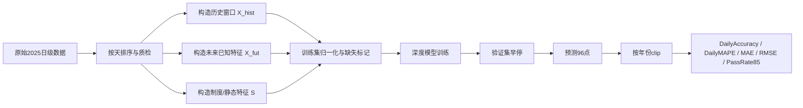
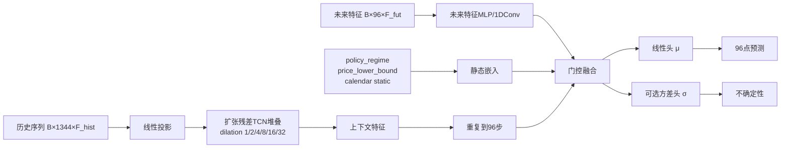
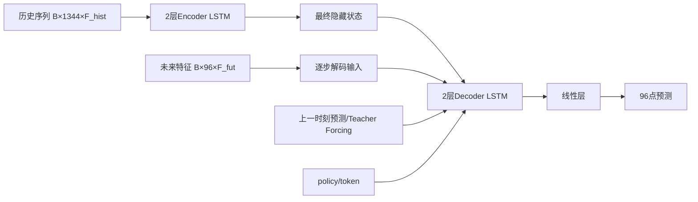
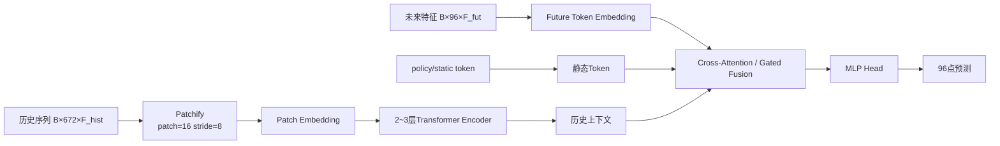

# 在仅使用2025年数据的日前96点电价预测深度学习模型设计报告

## 执行摘要

本项目最关键的现实约束，不是“模型种类不够多”，而是**样本量极小且制度边界会变化**。按题设，2025年只有约365天、每天96点，共约35,040个点；若按“用过去14天预测下一天96点”的日级监督方式构造样本，则总监督窗口只有约351个，其中训练/验证窗口约278个、测试窗口73个。这个量级不支持盲目堆大模型，更不适合直接上大参数 Transformer 或时间序列基础模型；文献与近两年的基准研究也都显示，日前电价预测的强模型通常具备三个共同点：**显式利用市场/供需特征、采用多步联合建模、并且控制模型复杂度**。综述研究指出，日前市场里混合模型与集成模型仍然很强，深度学习的发展趋势则正从“纯点预测”转向“概率化、市场机制感知、制度感知”的建模。citeturn22view0turn23view0turn35search1turn35search5

从中国现货市场规则看，**96点、15分钟粒度**是正式制度对象；市场出清还天然依赖负荷预测、联络线计划、机组出力上下限、爬坡约束等边界信息。官方规则同时明确：现货市场必须有报价/出清价格上下限，而且这些上下限是可调整的；部分省级规则已把下限设为0元/兆瓦时，历史试运行中甚至出现过负价下限。这意味着你题设中的“2025年下限40、2026年允许0价”在建模上必须被视为**制度变量**，而不是异常值处理问题。citeturn37view0turn37view4turn37view2turn37view1turn25search7

结合近五年文献与中国场景，我给出的明确结论是：**短期落地优先做 TCN-based 直接96步模型；LSTM seq2seq 作为第二主力；小型 PatchTST/Patch-Transformer 作为中长期研究方向，而不是第一上线模型。**一方面，HeTCN 一类研究说明 TCN 在处理高波动、异方差电价方面有明显优势；另一方面，中国96点案例与西班牙/中东欧市场研究都表明，LSTM 在制度扰动或异常阶段仍然很有竞争力；而 Transformer 类模型在多变量、长上下文场景潜力很大，但在小样本、单市场、单年度设置下过拟合风险最高。citeturn17view2turn12view3turn12view4turn11view3turn10view10turn10view11

因此，本报告推荐的生产路线是：**“紧凑型 TCN + 业务对齐损失 + 年份化后处理 + LightGBM基线/残差集成”**；研究路线是：**“政策感知的 PatchTST-lite / TFT-lite + 小样本域适配 + 概率预测 + Conformal 校准”**。如果你的项目目标是尽快把 2025 测试集日均精度和 85% 通过率做上去，首选不是“最潮的模型”，而是**最贴合日级KPI、最能消化制度特征、最不容易过拟合的小模型**。citeturn22view0turn23view0turn35search1turn35search5turn30view0

## 任务边界与数据特征

下面先把需求边界钉死，避免后续方案跑偏。

| 项目 | 已知约束 | 设计含义 |
|---|---|---|
| 预测目标 | 日前市场下一日96点价格，15min粒度 | 必须做**多步联合预测**，不建议只做单点回归再拼接 |
| 数据周期 | 仅使用2025年数据 | 无法依赖跨年大样本；模型容量必须受控 |
| 训练/测试切分 | 按天划分80%/20% | 必须按**日期顺序**切分，禁止随机打散 |
| 价格边界 | 2025年价格范围为[40,1000]，含40与1000；2026年允许0价 | 输出层不宜写死40下界；应使用**按年份clip** |
| 特征 | 历史Price、负荷/新能源预测、竞价空间、联络线、抽蓄、时间特征等 | 典型的**历史观测 + 已知未来外生变量**问题 |
| 未指定项 | 超参数、缺失值处理等 | 一律记为“**无特定约束**”，但需要在方案中给出推荐 |

如果数据完整覆盖 2025-01-01 至 2025-12-31，那么按顺序 80%/20% 切分时，可直接取 **2025-01-01 至 2025-10-19** 为训练/验证区间，**2025-10-20 至 2025-12-31** 为最终测试区间。这样做的好处是业务上最真实，也与日前市场“只看过去信息预测未来一天”的时序约束一致。

中国官方规则层面，省间日前现货已经明确采用“每15分钟一个时段、每日96时段”的组织方式；市场系统功能指南也明确，日前出清以负荷预测、联络线计划、机组运行约束等为边界，并输出机组出力与市场出清电价。这与题设中的特征集合高度一致，说明你的数据字段不是附加信息，而是**市场价格形成机制的一部分**。citeturn37view0turn37view4

价格边界也必须制度化处理。国家层面的《电力现货市场基本规则（试行）》明确要求现货市场设置报价限价和出清限价；山西 2025 规则把申报下限暂定为0元/兆瓦时、上限定为1500元/兆瓦时；山东历史试运行参数还出现过电能量出清价格下限 -0.1 元/千瓦时的设置。换言之，**价格上下界是规则参数，不是噪声。**这正是为什么我建议在特征中显式加入 `policy_regime`、`price_lower_bound`、`price_upper_bound`，并在预测后处理时按年份 clip，而不是把边界值做成“异常点清洗”。citeturn37view2turn37view1turn25search7

另外，近年来多地政策正在取消固定分时电价、强化随行就市和市场化分时信号传导。这进一步增强了一个判断：**制度切换会改变价格分布的下尾，而不是只改变均值。**因此 2026 年 0 价场景对模型的挑战，本质上是**分布迁移**而不是“单几个极端点”。citeturn25search2

## 文献要点表

下表优先整理近五年文献，并保留若干经典早期工作。若原文摘要页未公开训练细节，我明确写“摘要页未明示”，不做臆测。

| 来源 | 方法 | 数据量/任务 | 损失/评价 | 结果摘要 | 适用场景 |
|---|---|---|---|---|---|
| **Lago et al., 2018**, *Forecasting spot electricity prices: Deep learning approaches and empirical comparison of traditional algorithms*, *Applied Energy*, DOI: **10.1016/j.apenergy.2018.02.069** citeturn24view1turn39view0 | 多种深度学习模型 + 27类传统/ML基准大比较 | EPEX-Belgium，2010-01-01 至 2016-11-30；训练43,536点，验证/测试各8,760点 | 以年度 out-of-sample 误差和统计显著性检验比较；神经网络用早停 | 深度学习模型相对当时 SOTA 获得统计显著改进；邻区价格、负荷/发电预测是重要信息 | 经典起点；说明**多变量+邻区+外生预测**是有效框架 |
| **Vega-Márquez et al., 2021**, *Use of Deep Learning Architectures for Day-Ahead Electricity Price Forecasting over Different Time Periods in the Spanish Electricity Market*, *Applied Sciences*, DOI: **10.3390/app11136097** citeturn10view0turn12view3turn12view4turn13view0 | LSTM/CNN/TCN/MLP + Tree/RF 对比 | 西班牙小时级日前电价；分正常期、疫情隔离期、市场异常期三段 | MAE、WAPE、MASE、MAPE | 隔离期 LSTM 最优，MAE **3.535€**、WAPE **0.112**；正常期 CNN 最优，MAE 约 **4.125€**；总体平均最强模型是 LSTM | 适合研究**制度/行为变动期**下的模型鲁棒性 |
| **Pavićević & Popović, 2022**, *Forecasting Day-Ahead Electricity Metrics with Artificial Neural Networks*, *Sensors*, DOI: **10.3390/s22031051** citeturn10view3turn14view0turn16view1turn14view6 | Dense、TCN、LSTM、AR-LSTM 及组合 | HUPX 小时级价格，共 **82,823** 小时值、**3451天**；用过去14天预测未来24h | 训练目标为 **MSE**；报告 MAE、MAPE 等 | 价格预测里 **Dense_LSTM_Dense** 与 **TCN_Dense** 最优，MAE 分别约 **6.70€** 与 **6.83€**，MAPE 约 **19.53%** 与 **19.45%** | 适合做**紧凑型结构对比**；说明 TCN/LSTM 组合优于单纯 LSTM |
| **Jiang et al., 2024**, *Probabilistic electricity price forecasting based on penalized temporal fusion transformer*, *Journal of Forecasting*, DOI: **10.1002/for.3084** citeturn20view0 | LASSO 专家模型 + 惩罚化 TFT，做概率预测 | Nord Pool 与 Polish Power Exchange | 以**概率预测表现**为主；摘要页未明示点预测损失 | 相比其他竞争方法，概率预测效果更优 | 适合需要**区间预测/风险管理**而非只做点预测的阶段 |
| **Shi et al., 2024**, *A robust electricity price forecasting framework based on heteroscedastic temporal Convolutional Network*, *IJEPES* 161:110177 citeturn17view2 | **HeTCN**：Encoder-Decoder TCN + heteroscedastic output layer + MLE loss + 多视角特征选择 | 五个不同电力市场的日前 EPF | **基于最大似然的异方差损失**；报告 MAE、sMAPE、RMSE | 相对 DeepAR，平均改进 **25.3% / 24.9% / 17.4%**；相对 TFT 平均改进 **17.6% / 14.4% / 13.6%** | 适合**高波动、异方差、价格尖峰**场景；对本项目的 TCN 主方案最有借鉴价值 |
| **Mubarak et al., 2024**, *Day-Ahead electricity price forecasting using a CNN-BiLSTM model in conjunction with autoregressive modeling and hyperparameter optimization*, *IJEPES* 161:110206 citeturn10view7turn11view4turn11view6 | CNN-BiLSTM-AR + PSO/GA/RS 超参优化 | 英国与德国日前市场 | RMSE、MAE | 在德国市场上，PSO-CNN-BiLSTM-AR 的 RMSE 和 MAE 分别下降 **16.7%**、**23.46%** | 适合**局部模式 + 长依赖 + 线性残差**并存的市场 |
| **中国案例 2024**, *A hybrid framework for day-ahead electricity spot-price forecasting: A case study in China* citeturn10view8turn10view9turn11view9turn11view12turn11view13 | **DSA相似日** + XGBoost 特征选择 + DNN + ATPE | 中国山东真实现货市场，**96点**日前预测 | 摘要页未明示训练损失；报告 MAE/MSE/RMSE/U2 | 测试集最低 **MAE=0.138、RMSE=0.166、U2=0.434**，显著优于其他模型 | 与本项目**最贴近**；强烈支持“相似日 + 外生特征 + 多步输出”思路 |
| **Li et al., 2025**, *A Transformer-based model fusing temporal dependence and variable correlation for short and medium-term electricity price forecasting* citeturn10view10turn10view11turn11view3 | **VTformer**：时间依赖 + 变量相关性的 Transformer | Nord Pool 与 Austria，**6年**数据；多步 horizon 为 24/48/96/168/336/720h | 摘要页未明示；与 CNN/RNN/Transformer 基线对比并做统计检验 | 在短中期多 horizon 上表现优于传统与深度学习基线 | 适合**多变量、多 horizon、较长上下文**的 Transformer 路线 |
| **中文案例 2025**, *基于长短期记忆网络的电力市场价格预测研究* citeturn29view1turn30view0 | 4层 LSTM + 多因素耦合（风电、光伏、联络线、负荷） | 中国某省，**15min×96点**；30天历史（2880时段）输入，另比较243天长历史 | 损失为 **RMSE**，优化器 **Adam** | 4层网络较稳；仅用近30天数据时，RMSE **28.62**、精确度 **87.63%**，明显优于更长历史的 **80.72%**；低价区更难预测 | 强烈支持**近期窗口优先**、**低价区要加权**、**外生边界变量很重要** |
| **Hornek et al., 2025**, *Benchmarking Pre-Trained Time Series Models for Electricity Price Forecasting*, 2025 EEM / arXiv:2506.08113 citeturn35search1turn35search5 | 多种预训练时间序列基础模型 vs 统计/ML 基线 | 德国、法国、荷兰、奥地利、比利时 2024 DAA，一天前滚动预测 | 多指标基准比较 | Chronos-Bolt 与 Time-MoE 在 TSFM 中较强，但**没有基础模型统计显著优于 biseasonal MSTL** | 适合作为**反例提醒**：本项目这种小样本设置，别先上大基础模型 |

除单篇实证外，两篇近年的综述对整体路线尤其重要。**O’Connor et al. (2025)** 系统比较日前、日内、平衡市场后指出：日前市场上**混合模型/集成模型整体表现最强**，但泛化性、可解释性和数据质量仍是老问题；**Yu et al. (2026)** 则把深度学习 EPF 拆成 backbone、head、loss 三个层面，明确指出领域趋势正在转向**概率化、微观结构感知、市场感知**。这两点直接决定了本项目不应只问“用不用 Transformer/LSTM”，而要问“**backbone 之外，head 和 loss 是否对齐市场机制与业务指标**”。citeturn22view0turn23view0

## 模型设计与训练评估方案

先给共同建模设定。对你的任务，最自然的输入分成三块：

- **历史观测序列** `X_hist ∈ R[B, T_hist, F_hist]`：过去 `L` 天的价格及过去可用的相关特征；
- **未来已知外生序列** `X_fut ∈ R[B, 96, F_fut]`：运行日已知的负荷/新能源预测、竞价空间、联络线计划、抽蓄计划、时间特征；
- **静态/制度特征** `S ∈ R[B, F_static]`：如 `policy_regime`、`price_lower_bound`、`price_upper_bound`、周末/节假日类型等。

其中，我建议：

- `L=14天` 作为 TCN/LSTM 主配置；
- `L=7天` 作为 PatchTST-lite 主配置，避免 patch 序列过长；
- 所有模型都输出 `Y_hat ∈ R[B, 96]`，即**直接产出整个目标日96点**，而不是每个点各训一个模型。

训练目标必须与业务口径一致。推荐设定分母下限常数 `c=40`，因为 2025 年实际市场下限为40，且 MAPE 在近零附近不稳定这一点已有文献明确指出；同时国内现货规则也表明低价甚至 0/负价是制度可能，不宜直接用传统 MAPE 训练。citeturn16view0turn37view1turn25search7

设  
\[
e_{d,t}=\frac{|\hat y_{d,t}-y_{d,t}|}{\max(|y_{d,t}|,40)}
\]

则建议把核心业务指标定义为：

\[
\text{DailyMAPE}_d = 100\times\frac{1}{96}\sum_{t=1}^{96} e_{d,t}
\]

\[
\text{DailyAccuracy}_d = 1-\frac{1}{96}\sum_{t=1}^{96} e_{d,t}
\]

\[
\text{DailyAccuracy} = \frac{1}{D}\sum_{d=1}^{D}\text{DailyAccuracy}_d
\]

\[
\text{PassRate}_{85} = \frac{1}{D}\sum_{d=1}^{D}\mathbf{1}[\text{DailyAccuracy}_d\ge 0.85]
\]

如果你还想看“每个点的精度”，可定义：

\[
\text{PointAccuracy}_{d,t} = \max\left(0,\, 1-e_{d,t}\right)
\]

日均精度就是对 96 个点的 `PointAccuracy` 或等价的相对误差再取日均。

我建议训练损失使用**加权相对 MAE + ramp 正则**：

\[
\mathcal{L}=\frac{\sum_{d,t}w_{d,t}e_{d,t}}{\sum_{d,t}w_{d,t}}
+\lambda_{\text{ramp}}\cdot
\frac{1}{95}\sum_{t=2}^{96}
\frac{|(\hat y_t-\hat y_{t-1})-(y_t-y_{t-1})|}{\max(|y_t-y_{t-1}|,40)}
\]

其中 `w_{d,t}` 推荐按“高价、低价边界、尖峰爬坡、合成0价样本”加权，并在**日内归一化到均值1**，避免少数极端天把整体训练拉偏。

下面给出三套主方案。它们分别借鉴了 TCN、seq2seq、Transformer/PatchTST/TFT 的核心思想：TCN 强于长卷积记忆与并行，seq2seq 适合已知未来协变量驱动的逐步解码，PatchTST 用 patch 降低注意力复杂度，TFT 则提供了 known-future inputs 的经典 multi-horizon 视角。citeturn7search0turn32search3turn8view11turn6search0turn32search4



**方案一：TCN-based multi-horizon direct head**

这是我最推荐的短期落地主方案。HeTCN 证明了 TCN + 异方差头 + MLE 在高波动电价上很强，而紧凑型 TCN 在统一基准里也往往不输 LSTM。对你这种“样本少但每个样本很长”的 96点任务，TCN 的卷积并行和较浅参数规模都更稳。citeturn17view2turn14view6



建议超参数：

- `history_days=14`
- `channels=64`
- `kernel_size=3`
- `num_blocks=6`
- `dropout=0.10~0.20`
- `weight_decay=1e-4`
- 参数量建议控制在 **20万~50万**

训练与正则建议：

- 主损失用上面的 `weighted relative MAE + ramp regularization`；
- 可选加一个轻量的异方差辅助头，训练时加 `0.05~0.10` 权重的 NLL；
- 数据增强只做**外生预测噪声注入**与**时间段dropout**，不建议 price mixup；
- 早停 patience 15~20，优化器 AdamW，`lr=1e-3` 起。

预期优点是：对**近邻时间依赖、每日时段性、局部尖峰和爬坡**刻画强；多步直接输出也最贴近 DailyAccuracy。短板是：如果变量间相关性极复杂，TCN 融合模块设计不当时会吃亏。

**方案二：LSTM seq2seq with known-future decoder**

LSTM 不是“老旧”，而是在这种小样本、强时间结构、制度易变的任务里仍然非常有用。西班牙对比研究中，LSTM 在疫情隔离期表现最好；中国96点案例也显示，4层 LSTM 在近期窗口上可以做到 87% 左右的预测精度，而且低价段更难这一点与你项目极为一致。citeturn12view3turn12view4turn30view0



建议超参数：

- `history_days=14`
- `hidden_size=64 or 96`
- `num_layers=2`
- `dropout=0.1`
- `teacher_forcing_ratio` 从 `1.0` 线性退火到 `0.5`
- `grad_clip=1.0`

训练与正则建议：

- 主损失仍用 `weighted relative MAE`；
- 加 `scheduled sampling`，降低推理期 exposure bias；
- 对 decoder 使用未来 known covariates，不要只喂上一时刻价格；
- 对历史输入加入 `feature dropout` 与 missingness mask。

预期优点是：对**制度切换、异常阶段、序列平滑结构**更友好，且实现简单、可解释。缺点是训练速度慢于 TCN，若做纯自回归 decoder，误差会向后传播，因此必须配合 teacher forcing / scheduled sampling。

**方案三：PatchTST-lite / 小型 Patch-Transformer**

我认可这个方向，但把它放在第三位，不是因为它弱，而是因为你这个任务的数据规模对它不友好。PatchTST 的补丁化设计能显著缩短 token 序列，并允许模型看到更长历史；近期 EPF 文献也表明，Transformer 在“时间依赖 + 变量相关性”并重的任务里有明显潜力。但 2025 单年、单市场的监督窗口太少，Transformer 需要做**小型化 + 强早停 + 可选自监督预训练**。citeturn6search0turn19view1turn10view10turn10view11



建议超参数：

- `history_days=7`
- `patch_len=16`（4小时）
- `stride=8`（2小时）
- `d_model=96`
- `n_heads=4`
- `n_layers=2 or 3`
- `ffn_dim=256`
- `dropout=0.1~0.2`

训练与正则建议：

- 仍以 `weighted relative MAE` 为主；
- 强制小模型，不用“大而全”配置；
- 可先在 2025 全部滚动窗口上做**masked patch reconstruction** 自监督，再监督微调；
- 加 patch masking、channel dropout、strong early stopping。

预期优点是：长上下文能力最好，对多变量关联表达丰富，后续比较容易接概率头或 regime token。缺点是：**最容易过拟合**，且你只有 2025 年数据时，很可能在验证集上好看、测试集上未必最稳。2025 年欧洲基准里，预训练时间序列基础模型也没有稳定压过简单强基线，这一点必须警惕。citeturn35search1turn35search5

综合排序，我的明确建议是：

1. **先做 TCN 主模型**
2. **再做 LSTM seq2seq 形成双模 ensemble**
3. **最后再上 PatchTST-lite，作为中长期研究与2026迁移准备**

## 政策变更应对、实验计划与代码骨架

### 政策变更与 2026 泛化

2026 允许 0 价，核心不是“clip 下界改一下”这么简单，而是**下尾分布形状和条件触发因素都变了**。建议把应对分成四层：

**第一层：显式制度特征。**  
无论 2025 训练集里 `policy_regime` 是否恒定，都应该在数据接口里预留 `policy_regime`、`price_lower_bound`、`price_upper_bound`。原因是这会把模型 API 从“只会预测 2025 的函数”变成“可条件化的价格映射器”。官方规则明确说明价格上下限是市场规则的一部分；多地又在推进市场化分时与价格信号直接传导，因此 regime 特征必须前置设计。citeturn37view2turn37view1turn25search2

**第二层：合成低价样本。**  
在只有 2025 标签时，不能凭空制造“全域 0 价”，但可以做**局部制度一致的低价增强**。具体建议是：

- 选出 2025 年里 **高光伏、低净负荷、强外送/强进口、抽蓄充电** 的中午时段；
- 用规则化映射，把这些时段的标签从 `[40,120]` 压缩到 `[0,80]` 的合成域；
- 只把这些样本作为**低权重辅助样本**，例如采样概率 0.2~0.3、或 loss 权重 0.3~0.5，不要与真实2025标签同权；
- 同时给这些样本打上 `policy_regime=2026`、`price_lower_bound=0`。

我不建议做激进生成式 augmentation，因为你的真实监督太少，最务实的方式还是**基于规则与净负荷场景的局部合成**。

**第三层：无标签域适配 + 少样本微调。**  
如果 2026 年开始后能先拿到一段**无标签 covariate**，可先做 scaler 重估、AdaBN/CORAL 一类轻量对齐；一旦拿到最早 **7~14天** 的 2026 真实价格，再做**最后一层或小头部 fine-tune**。对于 PatchTST-lite，可只微调投影层和 head；对于 TCN/LSTM，可只微调融合层和输出层。这样能最快适应“0价下尾”而不破坏 2025 学到的主体结构。

**第四层：按年份后处理。**  
模型输出保持原始实数域，推理后：

- 2025：`clip([40, 1000])`
- 2026：`clip([0, 1000])`

不要在网络内部把输出层写死为 `40 + softplus(z)`，因为这会直接损坏 2026 迁移能力。

### 实验时间表

| 工作项 | 预计人日 | 可交付物 |
|---|---:|---|
| 数据准备与质检 | 2.5 | 按天索引的数据表、缺失统计、异常说明、训练/验证/测试切分清单 |
| 规则基线：昨日同点 / 7日中位 | 1.0 | 两个可重复基线、DailyAccuracy 与 PassRate85 初值 |
| LightGBM 基线 | 1.5 | 多输出或逐点 LightGBM baseline、特征重要性、误差分箱 |
| TCN 主模型实现 | 3.0 | 可训练脚本、验证曲线、首个深度学习主结果 |
| LSTM seq2seq 实现 | 3.0 | 编解码训练脚本、teacher forcing/scheduled sampling 实验 |
| PatchTST-lite 实现 | 4.0 | 小型 Transformer 脚本、patch 参数对比、过拟合诊断 |
| 超参搜索 | 3.0 | Optuna/手工搜索日志、最优配置表 |
| 滚动交叉验证 | 2.0 | 3-fold rolling-origin 结果、方差分析 |
| 政策迁移实验 | 2.5 | `policy_regime`、`price_lower_bound`、合成0价样本实验报告 |
| 最终对比与集成 | 2.0 | 单模/双模/三模对比表、简单 convex ensemble 结果 |
| 报告撰写与复现整理 | 2.0 | 最终报告、配置文件、环境说明、复现实验步骤 |

**合计：约 24.5 人日。**

如果资源紧，只做前三周冲刺，我建议砍掉 PatchTST-lite 的大规模搜索，把资源集中在 **TCN + LSTM + LightGBM + policy adaptation** 上。

### 建议的消融矩阵

至少做下面五组消融，不然你很难知道模型到底学到了什么：

1. 只用历史 Price  
2. `Price + 负荷/新能源预测`  
3. `Price + 负荷/新能源 + 竞价空间/联络线/抽蓄`  
4. 第3组基础上再加 `policy_regime + price_lower_bound`  
5. 损失函数对比：`MSE` vs `Huber` vs `weighted relative MAE`

这里尤其要看两件事：  
一是**加入市场边界特征后，低价/高价段误差是否明显下降**；  
二是**业务对齐损失是否能比 MSE 明显提升 85% 通过率**。

### 可复现的代码骨架

下面给一套接近可直接落地的 Python/PyTorch 伪代码骨架。目标不是完整训练框架，而是把你最关心的**数据切分、损失、样本权重、后处理、DailyAccuracy**先钉死。

```python
from __future__ import annotations
from dataclasses import dataclass
from typing import Dict, Tuple, List
import numpy as np
import pandas as pd
import torch
import torch.nn as nn

YEAR_BOUNDS: Dict[int, Tuple[float, float]] = {
    2025: (40.0, 1000.0),
    2026: (0.0, 1000.0),
}

DENOM_FLOOR = 40.0   # 与业务日均精度对齐
HORIZON = 96


@dataclass
class WindowConfig:
    history_days: int = 14
    horizon: int = 96
    train_ratio: float = 0.8
    val_days: int = 28
    freq_per_day: int = 96


def split_days(df: pd.DataFrame, train_ratio: float = 0.8) -> Tuple[List[pd.Timestamp], List[pd.Timestamp]]:
    """按天顺序切分。禁止随机打散。"""
    days = sorted(pd.to_datetime(df["date"]).dt.normalize().unique())
    n_train = int(len(days) * train_ratio)
    return list(days[:n_train]), list(days[n_train:])


def clip_by_year(pred: np.ndarray, year: int) -> np.ndarray:
    lo, hi = YEAR_BOUNDS[int(year)]
    return np.clip(pred, lo, hi)


def build_daily_windows(
    df: pd.DataFrame,
    cfg: WindowConfig,
    hist_cols: List[str],
    fut_cols: List[str],
    target_col: str = "price",
) -> List[dict]:
    """
    假设 df 已经按 timestamp 升序，且每一天恰好 96 点。
    返回一个样本列表，每个样本预测“下一天96点”。
    """
    df = df.copy()
    df["date"] = pd.to_datetime(df["date"]).dt.normalize()
    day_list = sorted(df["date"].unique())

    samples = []
    L = cfg.history_days
    H = cfg.horizon

    for i in range(L, len(day_list)):
        target_day = day_list[i]
        hist_days = day_list[i - L:i]

        hist_block = df[df["date"].isin(hist_days)][hist_cols].values
        fut_block = df[df["date"] == target_day][fut_cols].values
        y_block = df[df["date"] == target_day][target_col].values

        if len(hist_block) != L * cfg.freq_per_day:
            continue
        if len(fut_block) != H or len(y_block) != H:
            continue

        samples.append({
            "target_day": target_day,
            "x_hist": hist_block.astype(np.float32),   # [L*96, F_hist]
            "x_fut": fut_block.astype(np.float32),     # [96, F_fut]
            "y": y_block.astype(np.float32),           # [96]
        })

    return samples


def make_point_weights(y_true: torch.Tensor) -> torch.Tensor:
    """
    y_true: [B, 96]
    加权逻辑：
    - 高价段加权
    - 低价边界段加权
    - 日内均值归一化到1
    """
    w = torch.ones_like(y_true)

    w = w + 0.50 * (y_true >= 800).float()
    w = w + 0.40 * (y_true <= 60).float()
    w = w + 0.30 * ((y_true >= 950) | (y_true <= 45)).float()

    # 日内归一化，避免某一天总权重过大
    w = w / w.mean(dim=1, keepdim=True).clamp_min(1e-6)
    return w


def weighted_relative_mae_loss(
    pred: torch.Tensor,
    target: torch.Tensor,
    weight: torch.Tensor | None = None,
    denom_floor: float = DENOM_FLOOR,
    lambda_ramp: float = 0.10,
) -> torch.Tensor:
    """
    pred/target: [B, 96]
    """
    denom = torch.clamp(target.abs(), min=denom_floor)
    rel_err = (pred - target).abs() / denom

    if weight is None:
        weight = torch.ones_like(rel_err)

    base = (rel_err * weight).sum() / weight.sum().clamp_min(1.0)

    # ramp consistency：鼓励相邻点变化趋势接近真实曲线
    dp = pred[:, 1:] - pred[:, :-1]
    dt = target[:, 1:] - target[:, :-1]
    ramp_denom = torch.clamp(dt.abs(), min=denom_floor)
    ramp = ((dp - dt).abs() / ramp_denom).mean()

    return base + lambda_ramp * ramp


def mae(y_true: np.ndarray, y_pred: np.ndarray) -> float:
    return float(np.mean(np.abs(y_pred - y_true)))


def rmse(y_true: np.ndarray, y_pred: np.ndarray) -> float:
    return float(np.sqrt(np.mean((y_pred - y_true) ** 2)))


def daily_mape(y_true: np.ndarray, y_pred: np.ndarray, denom_floor: float = DENOM_FLOOR) -> Tuple[float, np.ndarray]:
    """
    输入形状: [num_days, 96]
    """
    denom = np.maximum(np.abs(y_true), denom_floor)
    daily = 100.0 * np.mean(np.abs(y_pred - y_true) / denom, axis=1)
    return float(daily.mean()), daily


def daily_accuracy(y_true: np.ndarray, y_pred: np.ndarray, denom_floor: float = DENOM_FLOOR) -> Tuple[float, np.ndarray]:
    """
    DailyAccuracy_d = 1 - mean_t(|err| / max(|y|, 40))
    """
    denom = np.maximum(np.abs(y_true), denom_floor)
    day_acc = 1.0 - np.mean(np.abs(y_pred - y_true) / denom, axis=1)
    return float(day_acc.mean()), day_acc


def pass_rate_85(day_acc: np.ndarray) -> float:
    return float(np.mean(day_acc >= 0.85))


class DummyMultiHorizonModel(nn.Module):
    """
    这里只是骨架；实际可替换为 TCN / LSTM seq2seq / PatchTST-lite
    """
    def __init__(self, hist_dim: int, fut_dim: int, hidden: int = 64):
        super().__init__()
        self.hist_proj = nn.Linear(hist_dim, hidden)
        self.fut_proj = nn.Linear(fut_dim, hidden)
        self.head = nn.Sequential(
            nn.Linear(hidden * 2, hidden),
            nn.ReLU(),
            nn.Linear(hidden, 1)
        )

    def forward(self, x_hist: torch.Tensor, x_fut: torch.Tensor) -> torch.Tensor:
        """
        x_hist: [B, T_hist, F_hist]
        x_fut:  [B, 96, F_fut]
        """
        hist_ctx = self.hist_proj(x_hist).mean(dim=1, keepdim=True)  # [B,1,H]
        hist_ctx = hist_ctx.repeat(1, x_fut.size(1), 1)              # [B,96,H]
        fut_ctx = self.fut_proj(x_fut)                               # [B,96,H]
        h = torch.cat([hist_ctx, fut_ctx], dim=-1)
        y = self.head(h).squeeze(-1)                                 # [B,96]
        return y


def train_one_epoch(model, loader, optimizer, device="cpu"):
    model.train()
    total = 0.0
    count = 0
    for batch in loader:
        x_hist = batch["x_hist"].to(device)
        x_fut = batch["x_fut"].to(device)
        y = batch["y"].to(device)

        optimizer.zero_grad()
        pred = model(x_hist, x_fut)
        w = make_point_weights(y)
        loss = weighted_relative_mae_loss(pred, y, weight=w)
        loss.backward()
        torch.nn.utils.clip_grad_norm_(model.parameters(), max_norm=1.0)
        optimizer.step()

        total += loss.item()
        count += 1
    return total / max(count, 1)


@torch.no_grad()
def evaluate(model, loader, year: int, device="cpu") -> Dict[str, float]:
    model.eval()
    ys, ps = [], []

    for batch in loader:
        x_hist = batch["x_hist"].to(device)
        x_fut = batch["x_fut"].to(device)
        y = batch["y"].cpu().numpy()

        pred = model(x_hist, x_fut).cpu().numpy()
        pred = clip_by_year(pred, year=year)

        ys.append(y)
        ps.append(pred)

    y_true = np.concatenate(ys, axis=0)  # [N_days, 96]
    y_pred = np.concatenate(ps, axis=0)

    dacc_mean, dacc_each = daily_accuracy(y_true, y_pred)
    dmape_mean, _ = daily_mape(y_true, y_pred)

    return {
        "DailyAccuracy": dacc_mean,
        "DailyMAPE": dmape_mean,
        "MAE": mae(y_true, y_pred),
        "RMSE": rmse(y_true, y_pred),
        "PassRate85": pass_rate_85(dacc_each),
    }
```

这套骨架里最关键的五点是：

1. **按天切分**，而不是随机切分；  
2. **模型直接输出96点**，而不是逐点独立回归；  
3. **损失函数与 DailyAccuracy 对齐**，而不是只用 MSE；  
4. **样本权重显式强调高价、低价边界和尖峰段**；  
5. **预测后按年份 clip**，把 2025 与 2026 的规则差异放到后处理和 regime 特征里。  

如果你要继续往概率预测走，可以在 TCN 或 PatchTST-lite 头部再加一个 `sigma` 或 quantile head；但在当前阶段，我不建议一开始就把问题复杂化。

## 推荐路线、风险与参考来源

我给出的**短期可落地路线**是：

- 用 **TCN-based 直接96步模型** 做主力；
- 同步保留 **LightGBM** 作为强基线和解释工具；
- 再做一个 **LSTM seq2seq** 用于异常阶段和集成；
- 最终线上先用**简单凸组合**：例如按验证集 DailyAccuracy 求权重，而不是搞复杂 stacking；
- 输出前统一做 **按年份 clip**，并保留 `policy_regime`/`price_lower_bound` 特征；
- 指标以 **DailyAccuracy + PassRate85** 为主，不以单独 RMSE 定生死。

我给出的**长期研究路线**是：

- 把 PatchTST-lite 升级为 **policy-aware PatchTST / TFT-lite**；
- 引入 **概率头 + Conformal 校准**，同时输出点预测与置信区间；
- 在 2026 上线初期做 **few-shot fine-tune**；
- 若未来拿到更多年份或多个市场数据，再考虑更大的 Transformer 或 TSFM，但不要在当前 2025-only 条件下先砸进去。

最值得警惕的风险有六个。

第一，**时序泄漏**。任何随机切分、跨天标准化、未来信息进入历史窗口，都会让测试结果虚高。  
第二，**指标错配**。如果训练只盯 RMSE，模型往往会更在意高价点的平方误差，而你的业务真正关心的是按天平均相对误差与 85% 通过率。  
第三，**低价尾部失真**。2026 的 0 价不是噪声，它是制度允许的新分布。如果继续把标签压在 40 以上学，明年一定会偏。  
第四，**模型过大**。近年的 EPF 基准已经提醒过，预训练时间序列基础模型在电价场景里并没有稳定击败更简单的强基线。citeturn35search1turn35search5  
第五，**外生特征修订误差**。负荷/新能源“预测值”本身也有误差，训练时要把它当成 noisy known-future，而不是完美真值。  
第六，**边界硬编码**。不要在网络输出层硬写死 2025 的 40 下限，否则 2026 迁移会被自己卡死。

综合来看，如果你问我“现在这项目最应该怎么做”，我的答案非常明确：**先把 TCN 做对，把损失函数换成业务对齐的相对MAE，把政策边界做成显式变量，再用 LSTM 做第二模型，最后才考虑小型 Transformer。**这条路线最稳，也最符合近五年的 EPF 文献与中国现货市场制度现实。citeturn17view2turn22view0turn23view0turn30view0

**参考来源**

- Ciaran O’Connor, Mohamed Bahloul, Steven Prestwich, Andrea Visentin. 2025. *A Review of Electricity Price Forecasting Models in the Day-Ahead, Intra-Day, and Balancing Markets*. *Energies*, 18(12), 3097. DOI: **10.3390/en18123097**. citeturn22view0
- Runyao Yu, Derek W. Bunn, Julia Lin, et al. 2026. *Deep Learning for Electricity Price Forecasting: A Review of Day-Ahead, Intraday, and Balancing Electricity Markets*. arXiv: **2602.10071**. citeturn23view0
- Jesus Lago, Fjo De Ridder, Bart De Schutter. 2018. *Forecasting spot electricity prices: Deep learning approaches and empirical comparison of traditional algorithms*. *Applied Energy*, 221:386-405. DOI: **10.1016/j.apenergy.2018.02.069**. citeturn24view1turn39view0
- Belén Vega-Márquez, Cristina Rubio-Escudero, Isabel A. Nepomuceno-Chamorro, Ángel Arcos-Vargas. 2021. *Use of Deep Learning Architectures for Day-Ahead Electricity Price Forecasting over Different Time Periods in the Spanish Electricity Market*. *Applied Sciences*, 11(13), 6097. DOI: **10.3390/app11136097**. citeturn10view0turn13view0
- Milutin Pavićević, Tomo Popović. 2022. *Forecasting Day-Ahead Electricity Metrics with Artificial Neural Networks*. *Sensors*, 22(3), 1051. DOI: **10.3390/s22031051**. citeturn10view3turn16view1
- He Jiang, Sheng Pan, Yao Dong, Jianzhou Wang. 2024. *Probabilistic electricity price forecasting based on penalized temporal fusion transformer*. *Journal of Forecasting*, 43(5). DOI: **10.1002/for.3084**. citeturn20view0
- W. Shi et al. 2024. *A robust electricity price forecasting framework based on heteroscedastic temporal Convolutional Network*. *International Journal of Electrical Power & Energy Systems*, 161:110177. citeturn17view2
- H. Mubarak et al. 2024. *Day-Ahead electricity price forecasting using a CNN-BiLSTM model in conjunction with autoregressive modeling and hyperparameter optimization*. *International Journal of Electrical Power & Energy Systems*, 161:110206. citeturn10view7turn11view4
- 中国案例. 2024. *A hybrid framework for day-ahead electricity spot-price forecasting: A case study in China*. 山东现货市场96点案例，使用 DSA + XGBoost 特征选择 + DNN + ATPE。 citeturn10view8turn10view9turn11view9turn11view12
- Jin Li et al. 2025. *A Transformer-based model fusing temporal dependence and variable correlation for short and medium-term electricity price forecasting*. 多 horizon、多变量 Transformer 路线。 citeturn10view10turn10view11
- 中文文献. 2025. *基于长短期记忆网络的电力市场价格预测研究*. 中国某省15分钟96点案例，强调近期窗口与边界因素。 citeturn29view1turn30view0
- Timothée Hornek, Amir Sartipi, Igor Tchappi, Gilbert Fridgen. 2025. *Benchmarking Pre-Trained Time Series Models for Electricity Price Forecasting*. 2025 EEM / arXiv: **2506.08113**. citeturn35search1turn35search5
- Shaojie Bai, J. Zico Kolter, Vladlen Koltun. 2018. *An Empirical Evaluation of Generic Convolutional and Recurrent Networks for Sequence Modeling*. arXiv: **1803.01271**. citeturn7search0
- Kyunghyun Cho, Bart van Merrienboer, Caglar Gulcehre, et al. 2014. *Learning Phrase Representations using RNN Encoder-Decoder for Statistical Machine Translation*. DOI: **10.3115/v1/D14-1179**. citeturn32search3turn32search19
- Ashish Vaswani, Noam Shazeer, Niki Parmar, et al. 2017. *Attention Is All You Need*. arXiv: **1706.03762**. citeturn8view11
- Yuqi Nie, Nam H. Nguyen, Phanwadee Sinthong, Jayant Kalagnanam. 2023. *A Time Series is Worth 64 Words: Long-term Forecasting with Transformers*. arXiv: **2211.14730**. citeturn6search0
- Bryan Lim, Sercan Ö. Arık, Nicolas Loeff, Tomas Pfister. 2021. *Temporal Fusion Transformers for Interpretable Multi-horizon Time Series Forecasting*. DOI: **10.1016/j.ijforecast.2021.03.012**. citeturn32search0turn32search4
- Guolin Ke, Qi Meng, Thomas Finley, et al. 2017. *LightGBM: A Highly Efficient Gradient Boosting Decision Tree*. *NeurIPS 2017*. citeturn6search2turn6search6
- Tianqi Chen, Carlos Guestrin. 2016. *XGBoost: A Scalable Tree Boosting System*. DOI: **10.1145/2939672.2939785**. citeturn6search7turn6search11
- 国家发展改革委、国家能源局. 2023. *电力现货市场基本规则（试行）*. 明确现货市场应设置报价限价和出清限价。 citeturn37view2
- 国家发展改革委. 2026. *省间电力现货交易规则*. 明确日前现货按15分钟、96时段组织。 citeturn37view0
- 国家发展改革委. 2018. *电力市场运营系统现货交易功能指南*. 明确负荷预测、联络线计划、机组约束等是日前出清边界。 citeturn37view4
- 山西能源监管相关规则. 2025. *电力市场规则体系(V15.0)*. 明确申报价格下限暂定为0元/兆瓦时、上限1500元/兆瓦时。 citeturn37view1
- 山东能源监管历史试运行参数. 2020. *山东电力现货市场结算试运行期间有关市场参数*. 明确历史试运行中曾设置负价下限。 citeturn25search7